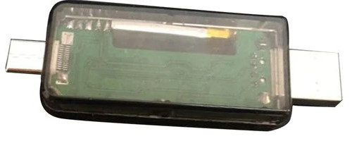

# switch-.uf2-files

Want .uf2 files for your switch hacking needs? If you request a payload be converted I should get around to it somewhat quickly.
<i>This is mainly meant for the https://github.com/euclala/RCM_typeC_ex Switch RCM-X86 dongle but it might work for other dongles and internal mods for the switch if it's based upon the Adafruit Trinket M0 board, but don't quote me on that :) </i>

 

<b>Please note</b>: This guide was made for users who have the <ins><b>Windows</b></ins> as their OS, while most of it could work for Mac OS or Linux I can not help you there, I have no experience on Mac OS and only use Linux on occasion or for hobby things. Most things should translate over somewhat evenly but the batch files probably won't.

   

<i>I take no credit for any files in this repository <b>(credits at the end of readme)</b>, except the few files that I made (those being the batch files), and I am not at fault for whatever harm they may or may not bring. All these files I located on the internet and I have modified a few of them (just to get them working and/or patched for this project) to make sure they work properly. You have been warned.</i>

<h1>Requirements</h1>
<ul>
<li>Python 3.x.x <i>(I'm using 3.8.5 as of making this)</i></li>

<li>Arduino IDE <i>(with the required archives, info taken from euclala's repository on how to do this)</i></li>

<li>Download and install Python https://www.python.org/downloads/ </li><ul>Python must be installed to path to work properly.</ul>

<li> Download and install arduino IDE. http://www.arduino.cc/en/Main/Software<ol><li> In Arduino: go to "<b>File</b> > <b>Preferences</b> > <b>Additional Board Manager URLs</b>" and add the following URL:</li>
<li> <code>https://adafruit.github.io/arduino-board-index/package_adafruit_index.json</code></li>
<li> Go to "<b>Tools</b> > <b>Board</b> > <b>Board Manager</b>" select Type:All and</li>
<li> Install "Arduino SAMD Boards" by Arduino <i>(This may take some time)</i></li>
<li> Install "Adafruit SAMD Boards" by Adafruit <i>(This may take some time)</i></li>
<li> Select the Trinket M0 with "<b>Tools</b> > <b>Board</b> > <b>Adafruit SAMD</b> > <b>Adafruit Trinket M0</b>"</li></ol>

<li>Go to "<b>Sketch</b> > <b>Include Library</b> > <b>Manage Libraries</b>"</li><ul><li>Install "USBHost" by Arduino</li></ul></li>

<li>Download the files in the build folder or the latest release of Build.7z <i>(working from the build folder makes it easy and keeps all of the files together)</i></li></ul>
 
<h2>Getting down to business </h2>
<i>(payload.bin to payload.h conversion)</i>
 

Once you reach this step you're mostly set up to make your own .uf2 files.

<i>(Note: The build.ino is from euclala's repository as well as one of the python files, with the other one being from microsoft. The batch files I created to make the python files a little easier to use.)</i>

<ul><p1><li>If you want to use the python files instead of the batch files<ol><li>Open cmd and cd to the location where you are working <i>(the command is <code>cd %file\location%</code>)</i></li> <li>Run this command in cmd <code>python binConverter.py %nameofpayload%.bin</code> to convert the .bin file to the %nameofpayload%.h file needed for build.ino.</li></ol></li></p1></ul>

<ul><p1><li>If you want to use the batch files <i>(easier)</i><ol><li>Open <b>1binConverter.bat</b> and enter the <code>%nameofpayload.bin%</code>.<i>(including the .bin part of it.)</i> It will convert the .bin file to the %nameofpayload%.h file needed for build.ino. </li></ol></li></p1></ul>

You could rename the %nameofpayload%.h or something easy but keep in mind you will still have to edit the build.ino to work.

 
<h2>How to build a .bin <i>(binary)</i> from .h </h2>
<i>(Using the build.ino to create binary and/or push binary to the board)</i>

 

If you have your own cfw you want to make a  .uf2 file for for you can name it accordingly and add it somewhere following 16 using the same format as the other options. I left lines 17 and 18 set up in a "blank" state so if you want you can edit them quickly. <i>(note: to use the build.ino you will have to edit it almost every time its used but its set up to do so easily, just remove the 2 forward slashes in front of the #include "%name.h%" you want to use and make sure the others have 2 forward slashes in front of them, if they do not the program will fail to compile)</i>

 

For example, let’s say you want to convert argon-nx, but you also have your own homemade cfw and add it to the list:

 

> //#include "sxos.h"

> //#include "rajnx.h"

> //#include "hekate.h"

> //#include "reinx.h"

> #include "argon-nx.h"

> //#include "homemadecfw01.h"

> //#include "homemadecfw02.h"

<i>Using the 2 forward slashes nulls the lines it’s on. This makes switching cfw builds easy as adding and removing 2 forward slashes. It does not matter the order they are in as long as only 1 is activated when running.</i>

Now your %nameofpayload%.h file should in the same folder as the build.ino, if so you are ready for the next step. At this time I would verify you have the proper board selected <i>("<b>Tools</b> > <b>Board</b> > <b>Adafruit SAMD</b> > <b>Adafruit Trinket M0</b>")</i>

Once the proper board is selected you can activate the right file in the build.ino. Like above you are going to remove the 2 forward slashes in front of the line of code you want to activate, and make sure the other #include %payloads%.h files are disabled. Now you should be able to verify the code using the verification button. When it's done verifying you can export the compiled binary under "<b>Sketch</b> > <b>Export Compiled Binary</b>". It should save to the build folder as build.ino.trinket_m0.bin.

Once you have your build.ino.trinket_m0.bin <i>(not a payload.bin, this is a binary file)</i> compiled from arduino IDE you can close arduino IDE. You can continue to the "<b>Final stretch</b>" to finish making the .uf2 file. <i>(While you can flash the board directly from the Arduino IDE, it requires a little bit more work, you can continue to "</i><b>The little bit more work</b><i>" if you want to setup directly board flashing.</i>

<ul><p1><li><b>The little bit more work</b> <i>(flashing the board directly)</i><ol><li>A driver is required to push the binary to the dongle from arduino IDE, it can be found below or if you want to get it yourself it is called adafruit_drivers_2.2.0.0.exe <i>(It is also in the Credits)</i></li><li>Warning! Connect the dongle to your computer and do not Click the Reset Button. Do not Click the Reset Button. Do not Click the Reset Button. <i>(This is the warning given by euclala for the RMCx86)</i></li><li>You can verify the file and then upload the compiled binary to the dongle under "<b>Tools</b> > <b>Port</b>> <b>trinket M0</b>".</li></ol></li></p1></ul>

[Driver](https://github.com/adafruit/Adafruit_Windows_Drivers/releases/download/2.2.0/adafruit_drivers_2.2.0.0.exe)
 
<h2>Final stretch here</h2>
<i>(Turning the binary .bin into a .uf2 file)</i>
 
<ul><p1><li>If you want to use the python files instead of the batch files<ol><li>Open cmd and cd to the location where you are working <i>(the command is <code>cd %file\location%</code>)</i></li><li>Run this command in cmd <code>python uf2conv.py -o %nameofpayload%.uf2 build.ino.trinket_m0.bin</code></li></ol></li></p1></ul>

<ul><p1><li>If you want to use the batch files <i>(easier)</i><ol><li>Open 2uf2conv.bat and input the name you would like the .uf2 to output as %name_of_file%.uf2 <i>(do not add the file extension in the batch file, it is coded into the batch file and not needed).</i></li></ol></li></p1></ul>
 

<p1>
 If done correctly the %name_of_file%.uf2 should have been created in the build folder. Put this file on your Adafruit Trinket M0 board however you normally do.</p1>
  
 <h4>You should be golden, enjoy.</h4>
 
  
  

Credits:
 
[Euclala](https://github.com/euclala/) for the build.ino and the binConverter.py
 
[Microsoft](https://github.com/microsoft/) for the uf2conv.py
 
[Adafruit](https://github.com/adafruit/) for the drivers
 
Link to [build.ino](https://github.com/euclala/fix_dongle/blob/master/build/build.ino), I have literally only added a 3 lines to it.
 
Link to [binConverter.py](https://github.com/euclala/fix_dongle/blob/master/tools/binConverter.py), I have changed mine a little but it's still mostly their code .
 
Link to [uf2conv.py](https://github.com/microsoft/uf2/blob/master/utils/uf2conv.py), I did have to edit this one quite a bit if I remember right.
 
Link to driver directly [here](https://github.com/adafruit/Adafruit_Windows_Drivers/releases/download/2.2.0/adafruit_drivers_2.2.0.0.exe) or [release page](https://github.com/adafruit/Adafruit_Windows_Drivers/releases/)
